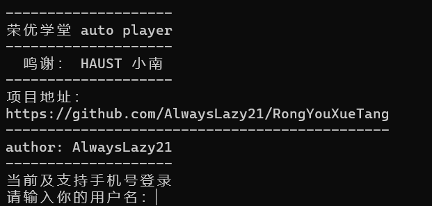

# AutoVideoBrush

该项目是一个针对 融优学堂 在学科目的视频自动观看脚本，刷视频的时候会不定时的刷学习次数     

**项目地址**：https://github.com/AlwaysLazy21/RongYouXueTang

## 运行图



## 安装

### 方法一：

在这里提供安装说明，包括所需的依赖项和安装步骤。可以使用以下命令：

```bash
pip install -r requirements.txt
python AutoVideoBrush.py
```

### 方法二：

下载exe程序使用

注：使用exe，启动比较慢。
### 已知问题

输入账号，密码后，会弹出来一个验证码图片，如果验证码默认打开方式不是自带的照片软件，而是第三方应用程序，那么请记住验证码后，把图片给叉掉，即可输入验证码。

## 运行状态

同目录下产生 图片、日志，属正常情况
